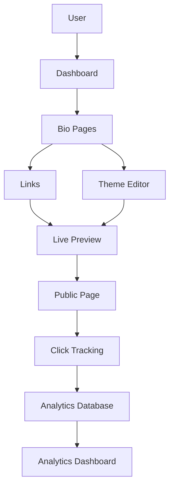

# Bio-Link Management System - Complete Design Documentation

## Overview

This document provides a comprehensive overview of the bio-link management application design. This advanced system allows users to create and manage multiple bio pages within a single account, with extensive theme customization, visibility controls, and real-time analytics.

## Project Summary

### Core Features

1. **Multiple Bio Pages**: Users can create unlimited bio pages per account
2. **Advanced Theme System**: Detailed theme customization with preset templates
3. **Individual Link Styling**: Customize each link independently
4. **Visibility Controls**: Toggle active/inactive status for pages and links
5. **Real-Time Analytics**: Comprehensive click tracking and statistics
6. **Live Preview**: Real-time preview of changes during editing
7. **Responsive Design**: Mobile-first, fully responsive interface

### Technology Stack

- **Frontend**: Next.js 15, React 19, TypeScript, Tailwind CSS v4
- **Backend**: Next.js API Routes, Drizzle ORM
- **Database**: PostgreSQL (Neon or local)
- **Authentication**: Better-Auth
- **State Management**: React Query (TanStack Query), React Context
- **UI Components**: shadcn/ui (new-york style)
- **Drag & Drop**: @dnd-kit
- **Charts**: Recharts
- **Forms**: react-hook-form, zod validation
- **Testing**: Jest, React Testing Library, Playwright

## Documentation Structure

This design documentation is organized into the following documents:

### 1. [Database Schema Design](./database-schema-design.md)

**Purpose**: Defines the database structure for the bio-link management system

**Key Contents**:

- Core tables: bio_pages, bio_links, theme_presets, link_analytics, link_analytics_aggregates
- Relationships and foreign keys
- Indexes for performance optimization
- Data types and constraints
- Migration strategy

**Highlights**:

- JSONB fields for flexible theme configurations
- Composite indexes for efficient queries
- Cascade deletes for data integrity
- Aggregated tables for fast analytics queries

### 2. [API Routes Architecture](./api-routes-architecture.md)

**Purpose**: Defines the RESTful API architecture for all CRUD operations

**Key Contents**:

- Bio Pages API (CRUD operations)
- Bio Links API (CRUD + reordering)
- Theme Presets API (CRUD + duplication)
- Analytics API (queries + tracking)
- Public Bio Page API (read-only)
- Authentication and authorization patterns
- Error handling and validation
- Rate limiting strategy

**Highlights**:

- RESTful design principles
- Comprehensive validation with Zod
- Pagination support
- Real-time click tracking
- Data export functionality

### 3. [Theme System Architecture](./theme-system-architecture.md)

**Purpose**: Defines the comprehensive theme customization system

**Key Contents**:

- Theme configuration structure (page-level and link-level)
- Theme provider and context
- Theme preset management
- Theme validation
- CSS generation from theme config
- Default themes
- Frontend theme components

**Highlights**:

- Hierarchical theme system (page > link > default)
- Reusable theme presets
- Extensive customization options (colors, typography, layout, buttons, background)
- Real-time theme application
- CSS variable-based implementation

### 4. [Analytics Tracking System](./analytics-tracking-system.md)

**Purpose**: Defines the comprehensive analytics and click tracking system

**Key Contents**:

- Client-side click tracking
- Server-side data processing
- Data aggregation strategy
- Analytics API endpoints
- Frontend analytics components
- Performance optimization
- Privacy and compliance

**Highlights**:

- Real-time click tracking
- Comprehensive visitor data (device, browser, location)
- UTM parameter support
- Pre-computed aggregations for performance
- Geographic distribution tracking
- Device breakdown analysis

### 5. [Frontend Component Structure](./frontend-component-structure.md)

**Purpose**: Defines the complete frontend component architecture

**Key Contents**:

- Component hierarchy and organization
- Layout components (dashboard, sidebar, header)
- Bio pages components (list, card, editor)
- Bio links components (list, item, form, drag-and-drop)
- Theme components (editor, picker, selector)
- Analytics components (dashboard, charts, statistics)
- Shared components (uploaders, inputs, feedback)
- Custom hooks for data management

**Highlights**:

- Modular component design
- Reusable UI components
- Drag-and-drop link reordering
- Real-time data updates
- Responsive design patterns
- Accessibility considerations

### 6. [Live Preview Functionality](./live-preview-functionality.md)

**Purpose**: Defines the real-time preview system for bio pages

**Key Contents**:

- Live preview architecture
- Preview components (frame, content, controls)
- Device selector (mobile, tablet, desktop, custom)
- Theme injection system
- Real-time updates
- Performance optimization
- Preview testing strategies

**Highlights**:

- Instant visual feedback
- Multiple device preview modes
- Custom viewport sizes
- Fullscreen preview mode
- Preview URL sharing
- Smooth animations and transitions

### 7. [Implementation Plan](./implementation-plan.md)

**Purpose**: Provides a detailed roadmap for implementation

**Key Contents**:

- 10 implementation phases (18 weeks)
- Detailed task breakdown with priorities
- Effort estimates for each task
- Risk assessment and mitigation strategies
- Success criteria
- Monitoring and metrics
- Maintenance and support plan

**Highlights**:

- Phased approach for manageable development
- Clear dependencies between tasks
- Comprehensive testing strategy
- Performance optimization focus
- Deployment and launch preparation

## Key Design Decisions

### 1. Database Design

- **PostgreSQL**: Chosen for reliability and JSONB support
- **Drizzle ORM**: Type-safe, modern ORM with excellent TypeScript support
- **Aggregated Tables**: Pre-computed statistics for fast analytics queries
- **Indexing Strategy**: Composite indexes for common query patterns

### 2. Theme System

- **JSONB Storage**: Flexible theme configurations in database
- **CSS Variables**: Dynamic theme application without style injection
- **Hierarchical System**: Page theme → Link theme → Default theme
- **Preset System**: Reusable theme templates for efficiency

### 3. Analytics Architecture

- **Event-Based Tracking**: Capture all clicks with metadata
- **Batch Processing**: Aggregate clicks in background jobs
- **Privacy-First**: Hash IP addresses, optional geolocation
- **Real-Time Updates**: WebSocket support for live dashboards

### 4. Frontend Architecture

- **React Query**: Server state management with caching
- **React Context**: Client state (theme, UI state)
- **Component Composition**: Reusable, composable components
- **Type Safety**: Full TypeScript coverage

### 5. Performance Strategy

- **Code Splitting**: Lazy load routes and components
- **Virtualization**: Virtual scrolling for long lists
- **Caching**: Redis for API responses, React Query for client cache
- **Optimization**: Image optimization, compression, CDN

## System Architecture

### High-Level Flow

### Data Flow

1. **Content Creation**: User creates bio pages and links in dashboard
2. **Theme Customization**: User applies themes and customizes appearance
3. **Live Preview**: Changes reflected in real-time preview
4. **Public View**: Visitors access bio page via public URL
5. **Click Tracking**: Clicks captured with metadata
6. **Data Aggregation**: Background jobs aggregate analytics
7. **Analytics Display**: Users view statistics in dashboard

## Security Considerations

1. **Authentication**: Better-Auth with session management
2. **Authorization**: Row-level security for user data
3. **Input Validation**: Zod schemas for all inputs
4. **SQL Injection**: Parameterized queries via Drizzle ORM
5. **XSS Prevention**: Sanitize user-generated content
6. **CSRF Protection**: CSRF tokens for state-changing operations
7. **Rate Limiting**: Prevent abuse of tracking API
8. **Data Privacy**: Hash IP addresses, optional geolocation

## Performance Targets

- **Page Load Time**: < 2 seconds
- **API Response Time**: < 200ms (p95)
- **Database Query Time**: < 50ms (p95)
- **Time to Interactive**: < 3 seconds
- **First Contentful Paint**: < 1 second

## Scalability Considerations

1. **Database**: Partition analytics table by date, use read replicas
2. **API**: Implement caching, rate limiting, and load balancing
3. **Frontend**: Code splitting, lazy loading, CDN for assets
4. **Analytics**: Data archiving, retention policies, aggregation optimization
5. **Storage**: Use object storage for images (S3, Cloudflare R2)

## Testing Strategy

### Unit Tests

- Test all utility functions
- Test API route handlers
- Test theme generation logic
- Test analytics calculations
- Target: 80%+ code coverage

### Integration Tests

- Test full CRUD workflows
- Test theme application
- Test analytics tracking
- Test authentication flow

### E2E Tests

- Test user registration
- Test bio page creation
- Test link management
- Test theme customization
- Test analytics viewing
- Test public page view

## Next Steps

### Immediate Actions

1. Review all design documents
2. Approve or request changes to architecture
3. Set up development environment
4. Begin Phase 1: Foundation

### Implementation Order

1. **Phase 1** (Week 1-2): Database setup and authentication
2. **Phase 2** (Week 3-4): Core API development
3. **Phase 3** (Week 5-6): Theme system implementation
4. **Phase 4** (Week 7-9): Frontend components
5. **Phase 5** (Week 10): Live preview functionality
6. **Phase 6** (Week 11-12): Analytics tracking
7. **Phase 7** (Week 13): Pages and routing
8. **Phase 8** (Week 14-15): Testing
9. **Phase 9** (Week 16): Performance optimization
10. **Phase 10** (Week 17-18): Deployment and launch

## Questions for Review

Please review the following questions and provide feedback:

1. **Database Schema**: Are all required fields included? Any missing relationships?
2. **API Design**: Are all endpoints sufficient? Any missing operations?
3. **Theme System**: Is the theme configuration comprehensive enough?
4. **Analytics**: Are all required metrics captured? Any missing insights?
5. **Frontend**: Is the component structure appropriate? Any missing components?
6. **Timeline**: Is the 18-week timeline realistic? Any adjustments needed?
7. **Priorities**: Are the task priorities correct? Any reordering needed?
8. **Technology**: Are all technology choices appropriate? Any alternatives?

## Conclusion

This comprehensive design provides a solid foundation for building an advanced bio-link management system that exceeds Linktree's capabilities. The modular architecture, phased implementation approach, and thorough documentation ensure a successful development process.

The system is designed to be:

- **Scalable**: Can handle growth in users and data
- **Performant**: Optimized for speed and efficiency
- **Maintainable**: Clean code with clear structure
- **Extensible**: Easy to add new features
- **User-Friendly**: Intuitive interface with real-time feedback

Please review all documents and provide feedback before proceeding with implementation.
