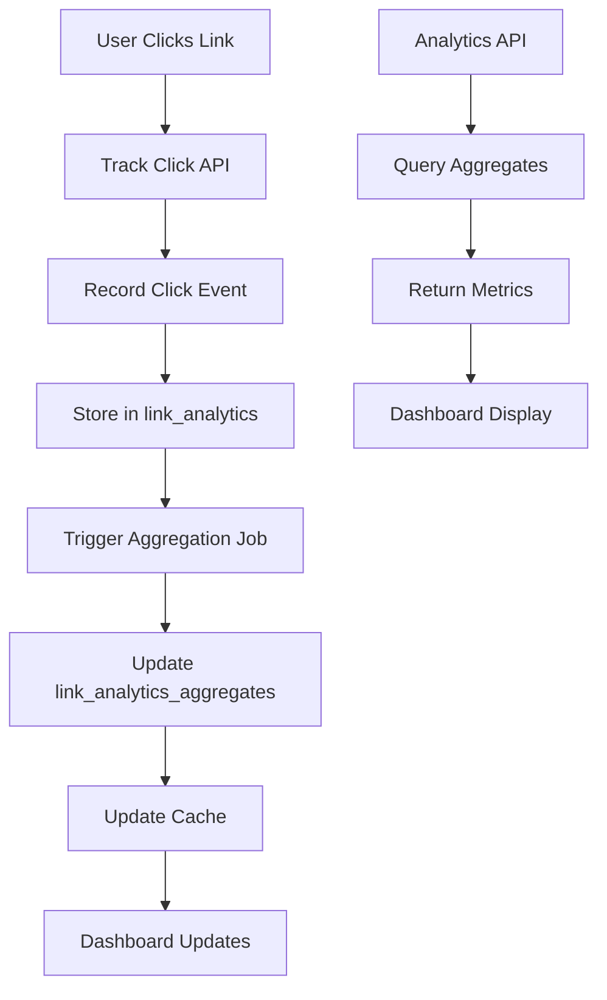

# Analytics Tracking System - Bio-Link Management System

## Overview

This document outlines the comprehensive analytics tracking system that captures, processes, and displays click statistics for bio links in real-time.

## Core Features

### 1. Click Tracking

- Track every click on bio links
- Capture visitor metadata (IP, user agent, referrer)
- Support UTM parameters for campaign tracking
- Real-time click recording

### 2. Data Processing

- Aggregate clicks by time periods (hourly, daily, weekly, monthly)
- Deduplicate unique clicks
- Extract device type and browser information
- Geolocation data (country, city)

### 3. Analytics Dashboard

- Real-time click counts
- Click trends over time
- Device breakdown (desktop, mobile, tablet)
- Geographic distribution
- Top referrers
- Top performing links
- UTM campaign analysis

### 4. Data Export

- Export analytics data as CSV or JSON
- Custom date range selection
- Include detailed metrics

## Architecture

### System Flow



### Data Flow

1. **Click Event Capture**
   - User clicks a link
   - JavaScript sends tracking request to API
   - API validates and records click
   - Click stored in `link_analytics` table

2. **Real-Time Processing**
   - Background job aggregates clicks
   - Updates `link_analytics_aggregates` table
   - Invalidates cache
   - Pushes updates to connected clients (WebSocket)

3. **Analytics Query**
   - Dashboard requests analytics data
   - API queries aggregated data
   - Returns formatted metrics
   - Dashboard visualizes data

## Database Schema

### link_analytics Table

Stores individual click events with detailed metadata.

```typescript
export const linkAnalytics = pgTable(
  'link_analytics',
  {
    id: uuid('id').primaryKey().defaultRandom(),
    bioLinkId: uuid('bio_link_id')
      .notNull()
      .references(() => bioLinks.id, { onDelete: 'cascade' }),
    bioPageId: uuid('bio_page_id')
      .notNull()
      .references(() => bioPages.id, { onDelete: 'cascade' }),

    // Click Information
    clickedAt: timestamp('clicked_at').defaultNow().notNull(),

    // Visitor Information
    ipAddress: text('ip_address'),
    userAgent: text('user_agent'),
    referrer: text('referrer'),
    country: text('country'),
    city: text('city'),
    deviceType: text('device_type'),
    browser: text('browser'),

    // UTM Parameters
    utmSource: text('utm_source'),
    utmMedium: text('utm_medium'),
    utmCampaign: text('utm_campaign'),
    utmTerm: text('utm_term'),
    utmContent: text('utm_content'),
  },
  (table) => [
    index('link_analytics_link_id_idx').on(table.bioLinkId),
    index('link_analytics_page_id_idx').on(table.bioPageId),
    index('link_analytics_clicked_at_idx').on(table.clickedAt),
    index('link_analytics_date_idx').on(sql`DATE(${table.clickedAt})`),
    index('link_analytics_ip_idx').on(table.ipAddress),
  ]
);
```

### link_analytics_aggregates Table

Pre-computed aggregated statistics for faster dashboard queries.

```typescript
export const linkAnalyticsAggregates = pgTable(
  'link_analytics_aggregates',
  {
    id: uuid('id').primaryKey().defaultRandom(),
    bioLinkId: uuid('bio_link_id')
      .notNull()
      .references(() => bioLinks.id, { onDelete: 'cascade' }),
    bioPageId: uuid('bio_page_id')
      .notNull()
      .references(() => bioPages.id, { onDelete: 'cascade' }),

    // Date Range
    date: date('date').notNull(),

    // Aggregated Metrics
    totalClicks: integer('total_clicks').default(0).notNull(),
    uniqueClicks: integer('unique_clicks').default(0).notNull(),

    // Device Breakdown
    desktopClicks: integer('desktop_clicks').default(0).notNull(),
    mobileClicks: integer('mobile_clicks').default(0).notNull(),
    tabletClicks: integer('tablet_clicks').default(0).notNull(),

    // Browser Breakdown
    chromeClicks: integer('chrome_clicks').default(0).notNull(),
    firefoxClicks: integer('firefox_clicks').default(0).notNull(),
    safariClicks: integer('safari_clicks').default(0).notNull(),
    edgeClicks: integer('edge_clicks').default(0).notNull(),
    otherBrowserClicks: integer('other_browser_clicks').default(0).notNull(),

    // Top Referrers (JSON array)
    topReferrers: jsonb('top_referrers').$type<
      Array<{
        referrer: string;
        count: number;
      }>
    >(),

    // Geographic Distribution (JSON object)
    topCountries: jsonb('top_countries').$type<Record<string, number>>(),

    // UTM Campaign Data
    utmSourceBreakdown: jsonb('utm_source_breakdown').$type<
      Record<string, number>
    >(),
    utmMediumBreakdown: jsonb('utm_medium_breakdown').$type<
      Record<string, number>
    >(),
    utmCampaignBreakdown: jsonb('utm_campaign_breakdown').$type<
      Record<string, number>
    >(),

    // Updated At
    updatedAt: timestamp('updated_at')
      .defaultNow()
      .$onUpdate(() => new Date())
      .notNull(),
  },
  (table) => [
    index('analytics_agg_link_date_idx').on(table.bioLinkId, table.date),
    index('analytics_agg_page_date_idx').on(table.bioPageId, table.date),
  ]
);
```

## Click Tracking Implementation

### 1. Client-Side Tracking

JavaScript function to track clicks on bio links.

```typescript
// lib/analytics/tracker.ts
export class LinkTracker {
  private trackingEndpoint: string;
  private batchSize: number;
  private clickQueue: ClickEvent[];
  private flushInterval: number;

  constructor(
    config: {
      trackingEndpoint?: string;
      batchSize?: number;
      flushInterval?: number;
    } = {}
  ) {
    this.trackingEndpoint = config.trackingEndpoint || '/api/v1/track-click';
    this.batchSize = config.batchSize || 10;
    this.flushInterval = config.flushInterval || 5000; // 5 seconds
    this.clickQueue = [];

    this.setupBatchFlush();
  }

  /**
   * Track a click event
   */
  trackClick(bioLinkId: string, bioPageId: string, url: string) {
    const clickEvent: ClickEvent = {
      bioLinkId,
      bioPageId,
      url,
      timestamp: new Date().toISOString(),
      ...this.captureVisitorInfo(),
      ...this.captureUTMParams(),
    };

    this.clickQueue.push(clickEvent);

    if (this.clickQueue.length >= this.batchSize) {
      this.flushQueue();
    }
  }

  /**
   * Capture visitor information
   */
  private captureVisitorInfo(): VisitorInfo {
    return {
      userAgent: navigator.userAgent,
      referrer: document.referrer || null,
      language: navigator.language,
      screenWidth: window.screen.width,
      screenHeight: window.screen.height,
    };
  }

  /**
   * Capture UTM parameters from URL
   */
  private captureUTMParams(): UTMParams {
    const urlParams = new URLSearchParams(window.location.search);
    return {
      utmSource: urlParams.get('utm_source'),
      utmMedium: urlParams.get('utm_medium'),
      utmCampaign: urlParams.get('utm_campaign'),
      utmTerm: urlParams.get('utm_term'),
      utmContent: urlParams.get('utm_content'),
    };
  }

  /**
   * Setup automatic queue flush
   */
  private setupBatchFlush() {
    setInterval(() => {
      if (this.clickQueue.length > 0) {
        this.flushQueue();
      }
    }, this.flushInterval);
  }

  /**
   * Flush queued clicks to server
   */
  private async flushQueue() {
    if (this.clickQueue.length === 0) return;

    const clicksToSend = [...this.clickQueue];
    this.clickQueue = [];

    try {
      await fetch(this.trackingEndpoint, {
        method: 'POST',
        headers: {
          'Content-Type': 'application/json',
        },
        body: JSON.stringify({ clicks: clicksToSend }),
        keepalive: true, // Ensure request completes even if page unloads
      });
    } catch (error) {
      console.error('Failed to track clicks:', error);
      // Re-queue failed clicks
      this.clickQueue.unshift(...clicksToSend);
    }
  }

  /**
   * Track click and navigate to URL
   */
  trackAndNavigate(bioLinkId: string, bioPageId: string, url: string) {
    this.trackClick(bioLinkId, bioPageId, url);

    // Small delay to ensure tracking request is sent
    setTimeout(() => {
      window.location.href = url;
    }, 100);
  }
}

interface ClickEvent {
  bioLinkId: string;
  bioPageId: string;
  url: string;
  timestamp: string;
  userAgent: string;
  referrer: string | null;
  language: string;
  screenWidth: number;
  screenHeight: number;
  utmSource?: string | null;
  utmMedium?: string | null;
  utmCampaign?: string | null;
  utmTerm?: string | null;
  utmContent?: string | null;
}

interface VisitorInfo {
  userAgent: string;
  referrer: string | null;
  language: string;
  screenWidth: number;
  screenHeight: number;
}

interface UTMParams {
  utmSource?: string | null;
  utmMedium?: string | null;
  utmCampaign?: string | null;
  utmTerm?: string | null;
  utmContent?: string | null;
}

// Initialize tracker
export const linkTracker = new LinkTracker();
```

### 2. Server-Side Tracking API

API endpoint to receive and process click events.

```typescript
// app/api/v1/track-click/route.ts
import { NextRequest, NextResponse } from 'next/server';
import { db } from '@/lib/db';
import { linkAnalytics } from '@/lib/db/schema';
import { nanoid } from 'nanoid';
import { parseUserAgent } from '@/lib/analytics/user-agent-parser';
import { getGeolocation } from '@/lib/analytics/geolocation';
import { hashIP } from '@/lib/analytics/ip-hasher';

export async function POST(request: NextRequest) {
  try {
    const body = await request.json();
    const { clicks } = body;

    if (!Array.isArray(clicks) || clicks.length === 0) {
      return NextResponse.json(
        { error: { code: 'VALIDATION_ERROR', message: 'Invalid clicks data' } },
        { status: 400 }
      );
    }

    const ipAddress = getClientIP(request);

    // Process each click event
    const clickRecords = await Promise.all(
      clicks.map(async (click) => {
        const { userAgent, screenWidth, screenHeight } = click;

        // Parse user agent
        const deviceInfo = parseUserAgent(userAgent);

        // Get geolocation (optional, may require external API)
        const geoInfo = await getGeolocation(ipAddress);

        // Hash IP for privacy
        const hashedIP = hashIP(ipAddress);

        return {
          id: nanoid(),
          bioLinkId: click.bioLinkId,
          bioPageId: click.bioPageId,
          clickedAt: new Date(click.timestamp),
          ipAddress: hashedIP,
          userAgent: userAgent,
          referrer: click.referrer,
          country: geoInfo?.country || null,
          city: geoInfo?.city || null,
          deviceType: deviceInfo.deviceType,
          browser: deviceInfo.browser,
          utmSource: click.utmSource || null,
          utmMedium: click.utmMedium || null,
          utmCampaign: click.utmCampaign || null,
          utmTerm: click.utmTerm || null,
          utmContent: click.utmContent || null,
        };
      })
    );

    // Insert click records in batch
    await db.insert(linkAnalytics).values(clickRecords);

    // Trigger aggregation job (can be async)
    triggerAggregationJob(clicks.map((c) => c.bioPageId));

    return NextResponse.json({
      message: 'Clicks tracked successfully',
      count: clickRecords.length,
    });
  } catch (error) {
    console.error('Failed to track clicks:', error);
    return NextResponse.json(
      { error: { code: 'INTERNAL_ERROR', message: 'Failed to track clicks' } },
      { status: 500 }
    );
  }
}

function getClientIP(request: NextRequest): string {
  const forwarded = request.headers.get('x-forwarded-for');
  const realIP = request.headers.get('x-real-ip');

  if (forwarded) {
    return forwarded.split(',')[0].trim();
  }

  if (realIP) {
    return realIP;
  }

  return request.ip || 'unknown';
}

function triggerAggregationJob(bioPageIds: string[]) {
  // Trigger background job to aggregate clicks
  // This can be implemented with a job queue like Bull, Agenda, or a cron job
  // For now, we'll use a simple timeout-based approach
  setTimeout(async () => {
    for (const pageId of bioPageIds) {
      await aggregateClicksForPage(pageId);
    }
  }, 1000);
}
```

### 3. User Agent Parser

Parse user agent strings to extract device and browser information.

```typescript
// lib/analytics/user-agent-parser.ts
interface DeviceInfo {
  deviceType: 'desktop' | 'mobile' | 'tablet';
  browser: 'chrome' | 'firefox' | 'safari' | 'edge' | 'other';
  os: string;
}

export function parseUserAgent(userAgent: string): DeviceInfo {
  const ua = userAgent.toLowerCase();

  // Detect device type
  let deviceType: 'desktop' | 'mobile' | 'tablet' = 'desktop';

  if (/mobile|android|iphone|ipod|blackberry|iemobile|opera mini/i.test(ua)) {
    deviceType = 'mobile';
  } else if (/ipad|tablet|kindle|silk/i.test(ua)) {
    deviceType = 'tablet';
  }

  // Detect browser
  let browser: 'chrome' | 'firefox' | 'safari' | 'edge' | 'other' = 'other';

  if (/chrome|crios|crmo/i.test(ua) && !/edge|opr|edg/i.test(ua)) {
    browser = 'chrome';
  } else if (/firefox|fxios/i.test(ua)) {
    browser = 'firefox';
  } else if (
    /safari/i.test(ua) &&
    !/chrome|crios|crmo|edge|opr|edg/i.test(ua)
  ) {
    browser = 'safari';
  } else if (/edge|edg|opr/i.test(ua)) {
    browser = 'edge';
  }

  // Detect OS
  let os = 'Unknown';
  if (/windows/i.test(ua)) {
    os = 'Windows';
  } else if (/mac|macintosh/i.test(ua)) {
    os = 'macOS';
  } else if (/linux/i.test(ua)) {
    os = 'Linux';
  } else if (/android/i.test(ua)) {
    os = 'Android';
  } else if (/iphone|ipad|ipod/i.test(ua)) {
    os = 'iOS';
  }

  return { deviceType, browser, os };
}
```

### 4. Geolocation Service

Get geographic information from IP address.

```typescript
// lib/analytics/geolocation.ts
interface GeoInfo {
  country: string;
  city: string;
  region: string;
  latitude: number;
  longitude: number;
}

export async function getGeolocation(
  ipAddress: string
): Promise<GeoInfo | null> {
  // Skip for localhost or unknown IPs
  if (
    ipAddress === 'unknown' ||
    ipAddress === '127.0.0.1' ||
    ipAddress === '::1'
  ) {
    return null;
  }

  try {
    // Use a free geolocation API (e.g., ip-api.com, ipinfo.io)
    // For production, consider using a paid service or self-hosted solution
    const response = await fetch(`http://ip-api.com/json/${ipAddress}`);
    const data = await response.json();

    if (data.status === 'success') {
      return {
        country: data.countryCode,
        city: data.city,
        region: data.regionName,
        latitude: data.lat,
        longitude: data.lon,
      };
    }

    return null;
  } catch (error) {
    console.error('Failed to get geolocation:', error);
    return null;
  }
}
```

### 5. IP Hashing

Hash IP addresses for privacy compliance.

```typescript
// lib/analytics/ip-hasher.ts
import { createHash } from 'crypto';

export function hashIP(ipAddress: string): string {
  // Use SHA-256 for hashing
  const hash = createHash('sha256');
  hash.update(ipAddress);
  return hash.digest('hex');
}
```

## Data Aggregation

### 1. Aggregation Job

Background job to aggregate clicks and update statistics.

```typescript
// lib/analytics/aggregator.ts
import { db } from '@/lib/db';
import { linkAnalytics, linkAnalyticsAggregates } from '@/lib/db/schema';
import { eq, and, gte, lte, sql } from 'drizzle-orm';

export async function aggregateClicksForPage(bioPageId: string) {
  const today = new Date();
  today.setHours(0, 0, 0, 0);

  // Get all clicks for today
  const clicks = await db.query.linkAnalytics.findMany({
    where: and(
      eq(linkAnalytics.bioPageId, bioPageId),
      gte(linkAnalytics.clickedAt, today)
    ),
  });

  // Group by link ID
  const clicksByLink = new Map<string, typeof clicks>();

  for (const click of clicks) {
    const linkId = click.bioLinkId;
    if (!clicksByLink.has(linkId)) {
      clicksByLink.set(linkId, []);
    }
    clicksByLink.get(linkId)!.push(click);
  }

  // Aggregate for each link
  for (const [linkId, linkClicks] of clicksByLink) {
    await aggregateClicksForLink(linkId, bioPageId, today, linkClicks);
  }
}

async function aggregateClicksForLink(
  bioLinkId: string,
  bioPageId: string,
  date: Date,
  clicks: (typeof linkAnalytics.$inferSelect)[]
) {
  // Calculate metrics
  const totalClicks = clicks.length;
  const uniqueClicks = new Set(clicks.map((c) => c.ipAddress)).size;

  // Device breakdown
  const deviceBreakdown = {
    desktop: clicks.filter((c) => c.deviceType === 'desktop').length,
    mobile: clicks.filter((c) => c.deviceType === 'mobile').length,
    tablet: clicks.filter((c) => c.deviceType === 'tablet').length,
  };

  // Browser breakdown
  const browserBreakdown = {
    chrome: clicks.filter((c) => c.browser === 'chrome').length,
    firefox: clicks.filter((c) => c.browser === 'firefox').length,
    safari: clicks.filter((c) => c.browser === 'safari').length,
    edge: clicks.filter((c) => c.browser === 'edge').length,
    other: clicks.filter((c) => c.browser === 'other').length,
  };

  // Top referrers
  const referrerCounts = new Map<string, number>();
  for (const click of clicks) {
    if (click.referrer) {
      const referrer = new URL(click.referrer).hostname;
      referrerCounts.set(referrer, (referrerCounts.get(referrer) || 0) + 1);
    }
  }
  const topReferrers = Array.from(referrerCounts.entries())
    .sort((a, b) => b[1] - a[1])
    .slice(0, 10)
    .map(([referrer, count]) => ({ referrer, count }));

  // Top countries
  const countryCounts = new Map<string, number>();
  for (const click of clicks) {
    if (click.country) {
      countryCounts.set(
        click.country,
        (countryCounts.get(click.country) || 0) + 1
      );
    }
  }
  const topCountries = Object.fromEntries(
    Array.from(countryCounts.entries())
      .sort((a, b) => b[1] - a[1])
      .slice(0, 10)
  );

  // UTM breakdown
  const utmSourceBreakdown = aggregateUTM(clicks, 'utmSource');
  const utmMediumBreakdown = aggregateUTM(clicks, 'utmMedium');
  const utmCampaignBreakdown = aggregateUTM(clicks, 'utmCampaign');

  // Check if aggregate record exists
  const existing = await db.query.linkAnalyticsAggregates.findFirst({
    where: and(
      eq(linkAnalyticsAggregates.bioLinkId, bioLinkId),
      eq(linkAnalyticsAggregates.date, date)
    ),
  });

  if (existing) {
    // Update existing record
    await db
      .update(linkAnalyticsAggregates)
      .set({
        totalClicks: existing.totalClicks + totalClicks,
        uniqueClicks: existing.uniqueClicks + uniqueClicks,
        desktopClicks: existing.desktopClicks + deviceBreakdown.desktop,
        mobileClicks: existing.mobileClicks + deviceBreakdown.mobile,
        tabletClicks: existing.tabletClicks + deviceBreakdown.tablet,
        chromeClicks: existing.chromeClicks + browserBreakdown.chrome,
        firefoxClicks: existing.firefoxClicks + browserBreakdown.firefox,
        safariClicks: existing.safariClicks + browserBreakdown.safari,
        edgeClicks: existing.edgeClicks + browserBreakdown.edge,
        otherBrowserClicks:
          existing.otherBrowserClicks + browserBreakdown.other,
        topReferrers,
        topCountries,
        utmSourceBreakdown,
        utmMediumBreakdown,
        utmCampaignBreakdown,
        updatedAt: new Date(),
      })
      .where(eq(linkAnalyticsAggregates.id, existing.id));
  } else {
    // Create new record
    await db.insert(linkAnalyticsAggregates).values({
      bioLinkId,
      bioPageId,
      date,
      totalClicks,
      uniqueClicks,
      desktopClicks: deviceBreakdown.desktop,
      mobileClicks: deviceBreakdown.mobile,
      tabletClicks: deviceBreakdown.tablet,
      chromeClicks: browserBreakdown.chrome,
      firefoxClicks: browserBreakdown.firefox,
      safariClicks: browserBreakdown.safari,
      edgeClicks: browserBreakdown.edge,
      otherBrowserClicks: browserBreakdown.other,
      topReferrers,
      topCountries,
      utmSourceBreakdown,
      utmMediumBreakdown,
      utmCampaignBreakdown,
    });
  }
}

function aggregateUTM(
  clicks: (typeof linkAnalytics.$inferSelect)[],
  field: 'utmSource' | 'utmMedium' | 'utmCampaign'
): Record<string, number> {
  const counts = new Map<string, number>();

  for (const click of clicks) {
    const value = click[field];
    if (value) {
      counts.set(value, (counts.get(value) || 0) + 1);
    }
  }

  return Object.fromEntries(counts);
}
```

### 2. Scheduled Aggregation

Cron job to run aggregation periodically.

```typescript
// scripts/aggregate-analytics.ts
import { aggregateClicksForPage } from '@/lib/analytics/aggregator';
import { db } from '@/lib/db';
import { bioPages } from '@/lib/db/schema';

async function runAggregation() {
  console.log('Starting analytics aggregation...');

  // Get all active bio pages
  const pages = await db.query.bioPages.findMany({
    where: eq(bioPages.isActive, true),
  });

  // Aggregate clicks for each page
  for (const page of pages) {
    try {
      await aggregateClicksForPage(page.id);
      console.log(`Aggregated clicks for page: ${page.id}`);
    } catch (error) {
      console.error(`Failed to aggregate clicks for page ${page.id}:`, error);
    }
  }

  console.log('Analytics aggregation completed');
}

// Run aggregation
runAggregation().catch(console.error);
```

## Analytics API

### 1. Get Bio Page Analytics

```typescript
// app/api/v1/bio-pages/[pageId]/analytics/route.ts
import { NextRequest, NextResponse } from 'next/server';
import { db } from '@/lib/db';
import { linkAnalyticsAggregates, bioLinks } from '@/lib/db/schema';
import { eq, and, gte, lte, sum, desc } from 'drizzle-orm';

export async function GET(
  request: NextRequest,
  { params }: { params: { pageId: string } }
) {
  try {
    const { searchParams } = new URL(request.url);
    const startDate = searchParams.get('startDate');
    const endDate = searchParams.get('endDate');
    const groupBy = searchParams.get('groupBy') || 'day';

    // Build date filter
    const dateFilter = [];
    if (startDate) {
      dateFilter.push(gte(linkAnalyticsAggregates.date, new Date(startDate)));
    }
    if (endDate) {
      dateFilter.push(lte(linkAnalyticsAggregates.date, new Date(endDate)));
    }

    // Get aggregated data
    const aggregates = await db.query.linkAnalyticsAggregates.findMany({
      where: and(
        eq(linkAnalyticsAggregates.bioPageId, params.pageId),
        ...dateFilter
      ),
      orderBy: [desc(linkAnalyticsAggregates.date)],
    });

    // Calculate totals
    const totalClicks = aggregates.reduce((sum, a) => sum + a.totalClicks, 0);
    const uniqueClicks = aggregates.reduce((sum, a) => sum + a.uniqueClicks, 0);

    // Get top links
    const linkStats = await db.query.linkAnalyticsAggregates.findMany({
      where: and(
        eq(linkAnalyticsAggregates.bioPageId, params.pageId),
        ...dateFilter
      ),
      columns: {
        bioLinkId: true,
        totalClicks: true,
      },
    });

    const linkClicksMap = new Map<string, number>();
    for (const stat of linkStats) {
      linkClicksMap.set(
        stat.bioLinkId,
        (linkClicksMap.get(stat.bioLinkId) || 0) + stat.totalClicks
      );
    }

    const topLinks = await Promise.all(
      Array.from(linkClicksMap.entries())
        .sort((a, b) => b[1] - a[1])
        .slice(0, 10)
        .map(async ([linkId, clicks]) => {
          const link = await db.query.bioLinks.findFirst({
            where: eq(bioLinks.id, linkId),
          });
          return {
            id: linkId,
            title: link?.title || 'Unknown',
            clicks,
            percentage: (clicks / totalClicks) * 100,
          };
        })
    );

    // Aggregate device breakdown
    const deviceBreakdown = {
      desktop: aggregates.reduce((sum, a) => sum + a.desktopClicks, 0),
      mobile: aggregates.reduce((sum, a) => sum + a.mobileClicks, 0),
      tablet: aggregates.reduce((sum, a) => sum + a.tabletClicks, 0),
    };

    // Aggregate top countries
    const countryCounts = new Map<string, number>();
    for (const agg of aggregates) {
      if (agg.topCountries) {
        for (const [country, count] of Object.entries(agg.topCountries)) {
          countryCounts.set(country, (countryCounts.get(country) || 0) + count);
        }
      }
    }
    const topCountries = Object.fromEntries(
      Array.from(countryCounts.entries())
        .sort((a, b) => b[1] - a[1])
        .slice(0, 10)
    );

    // Aggregate top referrers
    const referrerCounts = new Map<string, number>();
    for (const agg of aggregates) {
      if (agg.topReferrers) {
        for (const { referrer, count } of agg.topReferrers) {
          referrerCounts.set(
            referrer,
            (referrerCounts.get(referrer) || 0) + count
          );
        }
      }
    }
    const topReferrers = Array.from(referrerCounts.entries())
      .sort((a, b) => b[1] - a[1])
      .slice(0, 10)
      .map(([referrer, count]) => ({ referrer, count }));

    // Build timeline based on groupBy
    const timeline = buildTimeline(aggregates, groupBy);

    return NextResponse.json({
      data: {
        totalClicks,
        uniqueClicks,
        topLinks,
        deviceBreakdown,
        topCountries,
        topReferrers,
        timeline,
      },
    });
  } catch (error) {
    console.error('Failed to get analytics:', error);
    return NextResponse.json(
      { error: { code: 'INTERNAL_ERROR', message: 'Failed to get analytics' } },
      { status: 500 }
    );
  }
}

function buildTimeline(
  aggregates: (typeof linkAnalyticsAggregates.$inferSelect)[],
  groupBy: string
) {
  // Group aggregates by date period
  const grouped = new Map<string, number>();

  for (const agg of aggregates) {
    const date = new Date(agg.date);
    let key: string;

    switch (groupBy) {
      case 'day':
        key = date.toISOString().split('T')[0];
        break;
      case 'week':
        const weekStart = new Date(date);
        weekStart.setDate(date.getDate() - date.getDay());
        key = weekStart.toISOString().split('T')[0];
        break;
      case 'month':
        key = `${date.getFullYear()}-${String(date.getMonth() + 1).padStart(2, '0')}`;
        break;
      default:
        key = date.toISOString().split('T')[0];
    }

    grouped.set(key, (grouped.get(key) || 0) + agg.totalClicks);
  }

  return Array.from(grouped.entries())
    .map(([date, clicks]) => ({ date, clicks }))
    .sort((a, b) => a.date.localeCompare(b.date));
}
```

## Frontend Components

### 1. Analytics Dashboard

Main dashboard component for displaying analytics.

```typescript
// components/analytics/analytics-dashboard.tsx
'use client';

import * as React from 'react';
import { Card } from '@/components/ui/card';
import { Button } from '@/components/ui/button';
import { DateRangePicker } from '@/components/ui/date-range-picker';
import { AnalyticsOverview } from './analytics-overview';
import { ClickTrendChart } from './click-trend-chart';
import { DeviceBreakdown } from './device-breakdown';
import { TopLinks } from './top-links';
import { GeographicDistribution } from './geographic-distribution';

interface AnalyticsDashboardProps {
  bioPageId: string;
}

export function AnalyticsDashboard({ bioPageId }: AnalyticsDashboardProps) {
  const [dateRange, setDateRange] = React.useState({
    startDate: new Date(Date.now() - 30 * 24 * 60 * 60 * 1000), // 30 days ago
    endDate: new Date(),
  });
  const [analytics, setAnalytics] = React.useState(null);
  const [loading, setLoading] = React.useState(true);

  React.useEffect(() => {
    loadAnalytics();
  }, [bioPageId, dateRange]);

  async function loadAnalytics() {
    setLoading(true);
    try {
      const params = new URLSearchParams({
        startDate: dateRange.startDate.toISOString(),
        endDate: dateRange.endDate.toISOString(),
      });

      const response = await fetch(`/api/v1/bio-pages/${bioPageId}/analytics?${params}`);
      const data = await response.json();
      setAnalytics(data.data);
    } catch (error) {
      console.error('Failed to load analytics:', error);
    } finally {
      setLoading(false);
    }
  }

  if (loading) {
    return <div>Loading analytics...</div>;
  }

  if (!analytics) {
    return <div>No analytics data available</div>;
  }

  return (
    <div className="analytics-dashboard">
      <div className="dashboard-header">
        <h1>Analytics Dashboard</h1>
        <DateRangePicker
          value={dateRange}
          onChange={setDateRange}
        />
      </div>

      <AnalyticsOverview
        totalClicks={analytics.totalClicks}
        uniqueClicks={analytics.uniqueClicks}
      />

      <div className="dashboard-grid">
        <ClickTrendChart timeline={analytics.timeline} />
        <DeviceBreakdown data={analytics.deviceBreakdown} />
      </div>

      <div className="dashboard-grid">
        <TopLinks links={analytics.topLinks} />
        <GeographicDistribution countries={analytics.topCountries} />
      </div>
    </div>
  );
}
```

### 2. Real-Time Click Counter

Component to display real-time click counts.

```typescript
// components/analytics/real-time-counter.tsx
'use client';

import * as React from 'react';
import { Card } from '@/components/ui/card';

interface RealTimeCounterProps {
  bioLinkId: string;
}

export function RealTimeCounter({ bioLinkId }: RealTimeCounterProps) {
  const [clickCount, setClickCount] = React.useState(0);
  const [lastClickTime, setLastClickTime] = React.useState<Date | null>(null);

  React.useEffect(() => {
    // Poll for updates every 5 seconds
    const interval = setInterval(async () => {
      try {
        const response = await fetch(`/api/v1/bio-pages/links/${bioLinkId}/click-count`);
        const data = await response.json();
        setClickCount(data.count);
        setLastClickTime(new Date(data.lastClickTime));
      } catch (error) {
        console.error('Failed to fetch click count:', error);
      }
    }, 5000);

    return () => clearInterval(interval);
  }, [bioLinkId]);

  return (
    <Card className="real-time-counter">
      <div className="counter-value">{clickCount}</div>
      <div className="counter-label">Total Clicks</div>
      {lastClickTime && (
        <div className="last-click">
          Last click: {lastClickTime.toLocaleString()}
        </div>
      )}
    </Card>
  );
}
```

## Performance Optimization

### 1. Caching Strategy

- Cache aggregated analytics data in Redis
- Invalidate cache on new clicks
- Use CDN for static analytics assets

### 2. Database Optimization

- Use composite indexes for common queries
- Partition `link_analytics` table by date
- Use materialized views for complex aggregations

### 3. Batch Processing

- Batch click tracking requests
- Aggregate clicks in bulk
- Use background jobs for heavy computations

### 4. Rate Limiting

- Limit tracking API requests per IP
- Implement exponential backoff for failed requests
- Use request queuing for high traffic

## Privacy & Compliance

### 1. IP Address Handling

- Hash IP addresses before storage
- Provide option to anonymize data
- Allow users to delete their data

### 2. Data Retention

- Implement data retention policies
- Archive old analytics data
- Provide data export functionality

### 3. GDPR Compliance

- Obtain user consent for tracking
- Provide opt-out mechanism
- Respond to data deletion requests

## Security Considerations

1. **Input Validation**: Validate all tracking data
2. **Rate Limiting**: Prevent abuse of tracking API
3. **IP Spoofing**: Detect and block suspicious IPs
4. **SQL Injection**: Use parameterized queries
5. **XSS Prevention**: Sanitize referrer URLs

## Monitoring & Alerting

1. **Error Tracking**: Monitor tracking failures
2. **Performance Metrics**: Track API response times
3. **Data Quality**: Validate aggregated data
4. **Alert Thresholds**: Set up alerts for anomalies
