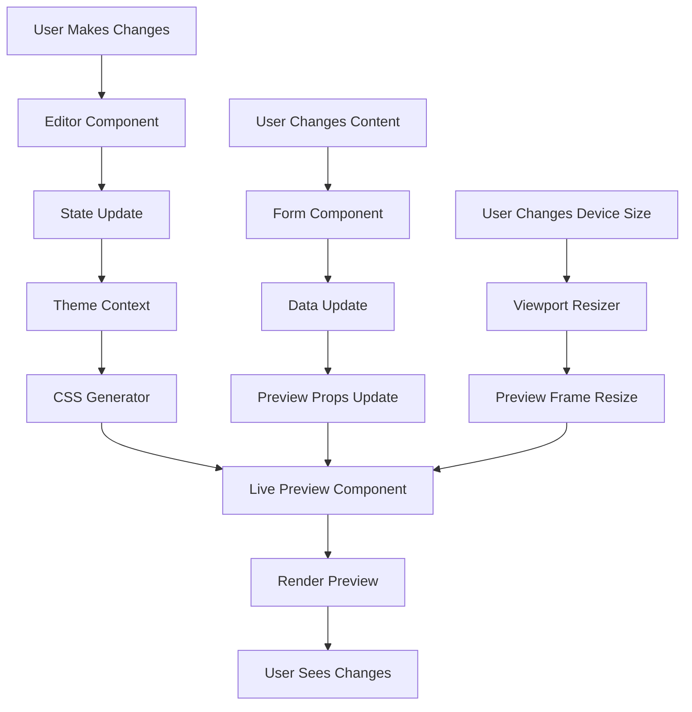

# Live Preview Functionality - Bio-Link Management System

## Overview

This document outlines the comprehensive live preview system that enables users to see real-time changes to their bio pages as they edit them, including theme customization, link management, and content updates.

## Core Features

### 1. Real-Time Theme Preview

- Instant visual feedback when changing theme settings
- Preview of colors, fonts, spacing, and layout
- Support for all theme properties (colors, typography, buttons, background)
- Smooth transitions between theme changes

### 2. Content Preview

- Live preview of bio page title, description, and avatar
- Real-time link updates (add, edit, delete, reorder)
- Preview of link icons, images, and descriptions
- Visibility toggle preview (show/hide links)

### 3. Responsive Preview

- Preview in multiple device sizes (mobile, tablet, desktop)
- Responsive design testing
- Orientation switching (portrait/landscape)
- Custom viewport sizes

### 4. Interactive Preview

- Clickable links (opens in new tab)
- Hover effects and animations
- Button interactions
- Scroll behavior preview

### 5. Preview Controls

- Refresh preview button
- Reset to default theme
- Copy preview URL
- Open in new tab
- Full-screen preview mode

## Architecture

### System Flow



### Component Architecture

```
LivePreview/
├── index.tsx                    # Main preview component
├── preview-frame.tsx            # Preview iframe/container
├── preview-content.tsx           # Actual bio page content
├── preview-controls.tsx          # Control buttons
├── device-selector.tsx           # Device size selector
├── viewport-resizer.tsx          # Custom viewport size
├── theme-injector.tsx           # Injects theme CSS
└── preview-toolbar.tsx           # Preview toolbar
```

## Core Components

### 1. LivePreview Component

Main preview component that orchestrates all preview functionality.

```typescript
// components/theme/live-preview/index.tsx
'use client';

import * as React from 'react';
import { useTheme } from '../theme-provider';
import { PreviewFrame } from './preview-frame';
import { PreviewControls } from './preview-controls';
import { DeviceSelector } from './device-selector';
import { generateThemeCSS } from '@/lib/theme/css-generator';

interface LivePreviewProps {
  bioPage: {
    id: string;
    title: string;
    description: string;
    avatarUrl: string;
    slug: string;
    links: Array<{
      id: string;
      title: string;
      url: string;
      description?: string;
      iconUrl?: string;
      imageUrl?: string;
      isActive: boolean;
      order: number;
      themeConfig?: BioLinkThemeConfig;
    }>;
  };
  onLinkClick?: (linkId: string) => void;
  editable?: boolean;
}

export function LivePreview({ bioPage, onLinkClick, editable = true }: LivePreviewProps) {
  const { theme } = useTheme();
  const [device, setDevice] = React.useState<'mobile' | 'tablet' | 'desktop' | 'custom'>('desktop');
  const [customSize, setCustomSize] = React.useState({ width: 600, height: 800 });
  const [isFullscreen, setIsFullscreen] = React.useState(false);
  const [showControls, setShowControls] = React.useState(true);
  const previewRef = React.useRef<HTMLDivElement>(null);

  const themeCSS = React.useMemo(() => generateThemeCSS(theme), [theme]);

  const activeLinks = React.useMemo(() =>
    bioPage.links.filter(link => link.isActive).sort((a, b) => a.order - b.order),
    [bioPage.links]
  );

  function getDeviceSize() {
    switch (device) {
      case 'mobile':
        return { width: 375, height: 667 };
      case 'tablet':
        return { width: 768, height: 1024 };
      case 'desktop':
        return { width: 1200, height: 800 };
      case 'custom':
        return customSize;
      default:
        return { width: 600, height: 800 };
    }
  }

  function handleRefresh() {
    // Force preview refresh
    if (previewRef.current) {
      previewRef.current.innerHTML = previewRef.current.innerHTML;
    }
  }

  function handleOpenInNewTab() {
    const url = `/p/${bioPage.slug}`;
    window.open(url, '_blank');
  }

  function handleCopyPreviewUrl() {
    const url = `${window.location.origin}/p/${bioPage.slug}`;
    navigator.clipboard.writeText(url);
    // Show toast notification
  }

  function handleToggleFullscreen() {
    setIsFullscreen(!isFullscreen);
  }

  return (
    <div className={`live-preview ${isFullscreen ? 'fullscreen' : ''}`}>
      {editable && (
        <PreviewControls
          onRefresh={handleRefresh}
          onOpenInNewTab={handleOpenInNewTab}
          onCopyUrl={handleCopyPreviewUrl}
          onToggleFullscreen={handleToggleFullscreen}
          onToggleControls={() => setShowControls(!showControls)}
          isFullscreen={isFullscreen}
          showControls={showControls}
        />
      )}

      {editable && showControls && (
        <DeviceSelector
          device={device}
          onDeviceChange={setDevice}
          customSize={customSize}
          onCustomSizeChange={setCustomSize}
        />
      )}

      <PreviewFrame
        ref={previewRef}
        width={getDeviceSize().width}
        height={getDeviceSize().height}
        themeCSS={themeCSS}
        bioPage={bioPage}
        links={activeLinks}
        onLinkClick={onLinkClick}
      />
    </div>
  );
}
```

### 2. PreviewFrame Component

Container for the preview content with proper styling and sizing.

```typescript
// components/theme/live-preview/preview-frame.tsx
'use client';

import * as React from 'react';
import { PreviewContent } from './preview-content';
import { ThemeInjector } from './theme-injector';

interface PreviewFrameProps {
  width: number;
  height: number;
  themeCSS: string;
  bioPage: LivePreviewProps['bioPage'];
  links: Array<LivePreviewProps['bioPage']['links'][0]>;
  onLinkClick?: (linkId: string) => void;
}

export const PreviewFrame = React.forwardRef<HTMLDivElement, PreviewFrameProps>(
  ({ width, height, themeCSS, bioPage, links, onLinkClick }, ref) => {
    const [isResizing, setIsResizing] = React.useState(false);
    const frameRef = React.useRef<HTMLDivElement>(null);

    React.useEffect(() => {
      // Update frame size when dimensions change
      if (frameRef.current) {
        frameRef.current.style.width = `${width}px`;
        frameRef.current.style.height = `${height}px`;
      }
    }, [width, height]);

    return (
      <div
        ref={frameRef}
        className="preview-frame"
        style={{
          width: `${width}px`,
          height: `${height}px`,
        }}
      >
        <ThemeInjector css={themeCSS} />
        <PreviewContent
          bioPage={bioPage}
          links={links}
          onLinkClick={onLinkClick}
        />
      </div>
    );
  }
);

PreviewFrame.displayName = 'PreviewFrame';
```

### 3. PreviewContent Component

Actual bio page content rendered in the preview.

```typescript
// components/theme/live-preview/preview-content.tsx
'use client';

import * as React from 'react';
import { cn } from '@/lib/utils';
import { ExternalLink } from 'lucide-react';

interface PreviewContentProps {
  bioPage: {
    title: string;
    description: string;
    avatarUrl: string;
  };
  links: Array<{
    id: string;
    title: string;
    url: string;
    description?: string;
    iconUrl?: string;
    imageUrl?: string;
    themeConfig?: BioLinkThemeConfig;
  }>;
  onLinkClick?: (linkId: string) => void;
}

export function PreviewContent({ bioPage, links, onLinkClick }: PreviewContentProps) {
  return (
    <div className="bio-page-preview">
      {/* Avatar */}
      {bioPage.avatarUrl && (
        
      )}

      {/* Title */}
      <h1 className="bio-title">{bioPage.title}</h1>

      {/* Description */}
      {bioPage.description && (
        <p className="bio-description">{bioPage.description}</p>
      )}

      {/* Links */}
      <div className="bio-links">
        {links.map((link) => (
          <LinkPreview
            key={link.id}
            link={link}
            onClick={() => onLinkClick?.(link.id)}
          />
        ))}
      </div>
    </div>
  );
}

function LinkPreview({ link, onClick }: { link: PreviewContentProps['links'][0]; onClick?: () => void }) {
  const [isHovered, setIsHovered] = React.useState(false);

  function handleClick(e: React.MouseEvent) {
    e.preventDefault();
    onClick?.();
    // Open link in new tab
    window.open(link.url, '_blank', 'noopener,noreferrer');
  }

  return (
    <a
      href={link.url}
      className={cn(
        'bio-link',
        link.themeConfig && 'custom-theme',
        isHovered && 'hovered'
      )}
      onClick={handleClick}
      onMouseEnter={() => setIsHovered(true)}
      onMouseLeave={() => setIsHovered(false)}
      target="_blank"
      rel="noopener noreferrer"
    >
      {/* Link Image */}
      {link.imageUrl && (
        
      )}

      {/* Link Content */}
      <div className="link-content">
        {/* Link Icon */}
        {link.iconUrl && (
          
        )}

        {/* Link Text */}
        <div className="link-text">
          <span className="link-title">{link.title}</span>
          {link.description && (
            <span className="link-description">{link.description}</span>
          )}
        </div>

        {/* External Link Icon */}
        <ExternalLink className="link-external-icon" />
      </div>
    </a>
  );
}
```

### 4. ThemeInjector Component

Injects theme CSS into the preview.

```typescript
// components/theme/live-preview/theme-injector.tsx
'use client';

import * as React from 'react';

interface ThemeInjectorProps {
  css: string;
}

export function ThemeInjector({ css }: ThemeInjectorProps) {
  const styleRef = React.useRef<HTMLStyleElement>(null);

  React.useEffect(() => {
    if (styleRef.current) {
      styleRef.current.textContent = css;
    }
  }, [css]);

  return (
    <style
      ref={styleRef}
      dangerouslySetInnerHTML={{ __html: css }}
    />
  );
}
```

### 5. PreviewControls Component

Control buttons for the preview.

```typescript
// components/theme/live-preview/preview-controls.tsx
'use client';

import * as React from 'react';
import { Button } from '@/components/ui/button';
import {
  RefreshCw,
  ExternalLink,
  Copy,
  Maximize2,
  Minimize2,
  Eye,
  EyeOff,
} from 'lucide-react';

interface PreviewControlsProps {
  onRefresh: () => void;
  onOpenInNewTab: () => void;
  onCopyUrl: () => void;
  onToggleFullscreen: () => void;
  onToggleControls: () => void;
  isFullscreen: boolean;
  showControls: boolean;
}

export function PreviewControls({
  onRefresh,
  onOpenInNewTab,
  onCopyUrl,
  onToggleFullscreen,
  onToggleControls,
  isFullscreen,
  showControls,
}: PreviewControlsProps) {
  return (
    <div className="preview-controls">
      <div className="controls-left">
        <Button
          variant="ghost"
          size="icon"
          onClick={onRefresh}
          title="Refresh Preview"
        >
          <RefreshCw />
        </Button>
        <Button
          variant="ghost"
          size="icon"
          onClick={onOpenInNewTab}
          title="Open in New Tab"
        >
          <ExternalLink />
        </Button>
        <Button
          variant="ghost"
          size="icon"
          onClick={onCopyUrl}
          title="Copy Preview URL"
        >
          <Copy />
        </Button>
      </div>

      <div className="controls-right">
        <Button
          variant="ghost"
          size="icon"
          onClick={onToggleControls}
          title={showControls ? 'Hide Controls' : 'Show Controls'}
        >
          {showControls ? <EyeOff /> : <Eye />}
        </Button>
        <Button
          variant="ghost"
          size="icon"
          onClick={onToggleFullscreen}
          title={isFullscreen ? 'Exit Fullscreen' : 'Fullscreen'}
        >
          {isFullscreen ? <Minimize2 /> : <Maximize2 />}
        </Button>
      </div>
    </div>
  );
}
```

### 6. DeviceSelector Component

Selector for different device sizes.

```typescript
// components/theme/live-preview/device-selector.tsx
'use client';

import * as React from 'react';
import { Button } from '@/components/ui/button';
import { Smartphone, Tablet, Monitor, Maximize2 } from 'lucide-react';
import { Slider } from '@/components/ui/slider';

interface DeviceSelectorProps {
  device: 'mobile' | 'tablet' | 'desktop' | 'custom';
  onDeviceChange: (device: 'mobile' | 'tablet' | 'desktop' | 'custom') => void;
  customSize: { width: number; height: number };
  onCustomSizeChange: (size: { width: number; height: number }) => void;
}

export function DeviceSelector({
  device,
  onDeviceChange,
  customSize,
  onCustomSizeChange,
}: DeviceSelectorProps) {
  const devices = [
    { id: 'mobile', icon: Smartphone, label: 'Mobile', size: '375 × 667' },
    { id: 'tablet', icon: Tablet, label: 'Tablet', size: '768 × 1024' },
    { id: 'desktop', icon: Monitor, label: 'Desktop', size: '1200 × 800' },
    { id: 'custom', icon: Maximize2, label: 'Custom', size: `${customSize.width} × ${customSize.height}` },
  ];

  return (
    <div className="device-selector">
      <div className="device-buttons">
        {devices.map((d) => {
          const Icon = d.icon;
          return (
            <Button
              key={d.id}
              variant={device === d.id ? 'default' : 'outline'}
              onClick={() => onDeviceChange(d.id as any)}
              className="device-button"
            >
              <Icon />
              <span>{d.label}</span>
              <span className="device-size">{d.size}</span>
            </Button>
          );
        })}
      </div>

      {device === 'custom' && (
        <div className="custom-size-controls">
          <div className="size-input">
            <label>Width</label>
            <Slider
              value={[customSize.width]}
              onValueChange={([width]) =>
                onCustomSizeChange({ ...customSize, width })
              }
              min={300}
              max={1920}
              step={10}
            />
            <span>{customSize.width}px</span>
          </div>
          <div className="size-input">
            <label>Height</label>
            <Slider
              value={[customSize.height]}
              onValueChange={([height]) =>
                onCustomSizeChange({ ...customSize, height })
              }
              min={400}
              max={1200}
              step={10}
            />
            <span>{customSize.height}px</span>
          </div>
        </div>
      )}
    </div>
  );
}
```

## Preview State Management

### Preview Context

Context for managing preview state across components.

```typescript
// components/theme/live-preview/preview-context.tsx
import * as React from 'react';

interface PreviewState {
  device: 'mobile' | 'tablet' | 'desktop' | 'custom';
  customSize: { width: number; height: number };
  isFullscreen: boolean;
  showControls: boolean;
  autoRefresh: boolean;
  refreshInterval: number;
}

interface PreviewContextValue {
  state: PreviewState;
  updateState: (updates: Partial<PreviewState>) => void;
  resetState: () => void;
}

const PreviewContext = React.createContext<PreviewContextValue | undefined>(undefined);

export function PreviewProvider({ children }: { children: React.ReactNode }) {
  const [state, setState] = React.useState<PreviewState>({
    device: 'desktop',
    customSize: { width: 600, height: 800 },
    isFullscreen: false,
    showControls: true,
    autoRefresh: true,
    refreshInterval: 5000,
  });

  const updateState = React.useCallback((updates: Partial<PreviewState>) => {
    setState(prev => ({ ...prev, ...updates }));
  }, []);

  const resetState = React.useCallback(() => {
    setState({
      device: 'desktop',
      customSize: { width: 600, height: 800 },
      isFullscreen: false,
      showControls: true,
      autoRefresh: true,
      refreshInterval: 5000,
    });
  }, []);

  return (
    <PreviewContext.Provider value={{ state, updateState, resetState }}>
      {children}
    </PreviewContext.Provider>
  );
}

export function usePreview() {
  const context = React.useContext(PreviewContext);
  if (!context) {
    throw new Error('usePreview must be used within PreviewProvider');
  }
  return context;
}
```

## Performance Optimization

### 1. Memoization

Memoize expensive computations and prevent unnecessary re-renders.

```typescript
// Memoize theme CSS generation
const themeCSS = React.useMemo(() => generateThemeCSS(theme), [theme]);

// Memoize active links
const activeLinks = React.useMemo(
  () =>
    bioPage.links
      .filter((link) => link.isActive)
      .sort((a, b) => a.order - b.order),
  [bioPage.links]
);

// Memoize device size
const deviceSize = React.useMemo(() => getDeviceSize(), [device, customSize]);
```

### 2. Debouncing

Debounce rapid state changes to reduce re-renders.

```typescript
import { useDebouncedValue } from '@/hooks/use-debounced-value';

const debouncedCustomSize = useDebouncedValue(customSize, 300);

React.useEffect(() => {
  // Update preview only after debounce
  updatePreview(debouncedCustomSize);
}, [debouncedCustomSize]);
```

### 3. Virtualization

Use virtual scrolling for long link lists.

```typescript
import { useVirtualizer } from '@tanstack/react-virtual';

const parentRef = React.useRef<HTMLDivElement>(null);

const virtualizer = useVirtualizer({
  count: links.length,
  getScrollElement: () => parentRef.current,
  estimateSize: () => 80,
  overscan: 5,
});
```

### 4. Lazy Loading

Load images and icons only when visible.

```typescript
import { LazyLoadImage } from '@/components/shared/lazy-load-image';

<LazyLoadImage
  src={link.imageUrl}
  alt={link.title}
  className="link-image"
/>
```

## Real-Time Updates

### 1. Theme Changes

Instant theme updates without page refresh.

```typescript
// When theme changes, update CSS immediately
React.useEffect(() => {
  const newCSS = generateThemeCSS(theme);
  setThemeCSS(newCSS);
}, [theme]);
```

### 2. Content Changes

Real-time content updates as user edits.

```typescript
// Update preview when bio page data changes
React.useEffect(() => {
  setPreviewData(bioPage);
}, [bioPage]);
```

### 3. Link Changes

Immediate updates when links are added, edited, or reordered.

```typescript
// Re-render links when links array changes
React.useEffect(() => {
  const sortedLinks = links.sort((a, b) => a.order - b.order);
  setPreviewLinks(sortedLinks);
}, [links]);
```

## Preview Modes

### 1. Edit Mode

Preview with editing controls and device selector.

```typescript
<LivePreview
  bioPage={bioPage}
  editable={true}
  onLinkClick={handleLinkClick}
/>
```

### 2. View Mode

Clean preview without controls.

```typescript
<LivePreview
  bioPage={bioPage}
  editable={false}
/>
```

### 3. Fullscreen Mode

Preview takes up entire screen.

```typescript
<LivePreview
  bioPage={bioPage}
  editable={true}
  initialFullscreen={true}
/>
```

## Responsive Preview

### Mobile Preview

```typescript
// 375 × 667 (iPhone SE)
<DeviceSelector device="mobile" />
```

### Tablet Preview

```typescript
// 768 × 1024 (iPad)
<DeviceSelector device="tablet" />
```

### Desktop Preview

```typescript
// 1200 × 800 (Desktop)
<DeviceSelector device="desktop" />
```

### Custom Preview

```typescript
// User-defined dimensions
<DeviceSelector device="custom" customSize={{ width: 800, height: 600 }} />
```

## Preview URL Sharing

### Generate Shareable Preview URL

```typescript
function generatePreviewUrl(
  bioPageSlug: string,
  themeConfig: BioPageThemeConfig
) {
  const baseUrl = `${window.location.origin}/p/${bioPageSlug}`;
  const params = new URLSearchParams();

  // Encode theme config as URL parameter
  params.set('theme', btoa(JSON.stringify(themeConfig)));

  return `${baseUrl}?preview=true&${params.toString()}`;
}
```

### Load Preview from URL

```typescript
function loadPreviewFromUrl() {
  const params = new URLSearchParams(window.location.search);
  const themeParam = params.get('theme');

  if (themeParam) {
    try {
      const themeConfig = JSON.parse(atob(themeParam));
      updateTheme(themeConfig);
    } catch (error) {
      console.error('Failed to load theme from URL:', error);
    }
  }
}
```

## Preview Testing

### 1. Visual Regression Testing

Compare preview with expected output.

```typescript
import { expect } from '@playwright/test';

test('preview matches design', async ({ page }) => {
  await page.goto('/dashboard/bio-pages/123/edit');

  const preview = page.locator('.live-preview');
  await expect(preview).toHaveScreenshot('bio-page-preview.png');
});
```

### 2. Theme Validation

Ensure all theme properties are applied correctly.

```typescript
function validateThemeApplied(theme: BioPageThemeConfig, preview: HTMLElement) {
  const computedStyle = window.getComputedStyle(preview);

  expect(computedStyle.getPropertyValue('--theme-primary')).toBe(
    theme.primaryColor
  );
  expect(computedStyle.getPropertyValue('--theme-background')).toBe(
    theme.backgroundColor
  );
  expect(computedStyle.getPropertyValue('--theme-font-family')).toBe(
    theme.fontFamily
  );
}
```

### 3. Responsive Testing

Test preview at different viewport sizes.

```typescript
test('preview is responsive', async ({ page }) => {
  await page.goto('/dashboard/bio-pages/123/edit');

  // Mobile
  await page.setViewportSize({ width: 375, height: 667 });
  await expect(page.locator('.bio-page-preview')).toBeVisible();

  // Tablet
  await page.setViewportSize({ width: 768, height: 1024 });
  await expect(page.locator('.bio-page-preview')).toBeVisible();

  // Desktop
  await page.setViewportSize({ width: 1200, height: 800 });
  await expect(page.locator('.bio-page-preview')).toBeVisible();
});
```

## Accessibility

### 1. Keyboard Navigation

Support keyboard navigation in preview.

```typescript
function handleKeyDown(e: React.KeyboardEvent) {
  switch (e.key) {
    case 'Escape':
      // Exit fullscreen
      break;
    case 'r':
      // Refresh preview
      break;
    case 'f':
      // Toggle fullscreen
      break;
  }
}
```

### 2. Screen Reader Support

Add ARIA labels and descriptions.

```typescript
<div
  className="preview-frame"
  role="region"
  aria-label="Bio page preview"
  aria-live="polite"
>
  {/* Preview content */}
</div>
```

### 3. Focus Management

Manage focus when entering/exiting fullscreen.

```typescript
function handleToggleFullscreen() {
  if (!isFullscreen) {
    // Save current focus
    previousFocusRef.current = document.activeElement;
    setIsFullscreen(true);
    // Move focus to preview
    previewRef.current?.focus();
  } else {
    setIsFullscreen(false);
    // Restore previous focus
    previousFocusRef.current?.focus();
  }
}
```

## Error Handling

### 1. Preview Load Error

Display error message when preview fails to load.

```typescript
const [previewError, setPreviewError] = React.useState<Error | null>(null);

React.useEffect(() => {
  try {
    // Load preview
  } catch (error) {
    setPreviewError(error as Error);
  }
}, []);

if (previewError) {
  return (
    <div className="preview-error">
      <p>Failed to load preview: {previewError.message}</p>
      <Button onClick={handleRetry}>Retry</Button>
    </div>
  );
}
```

### 2. Theme Application Error

Handle errors when applying theme.

```typescript
function applyTheme(theme: BioPageThemeConfig) {
  try {
    const css = generateThemeCSS(theme);
    setThemeCSS(css);
  } catch (error) {
    console.error('Failed to apply theme:', error);
    // Fallback to default theme
    setThemeCSS(generateThemeCSS(getDefaultTheme()));
  }
}
```

## Best Practices

### 1. Performance

- Use React.memo for expensive components
- Debounce rapid state changes
- Implement virtual scrolling for long lists
- Lazy load images and icons
- Optimize CSS generation

### 2. User Experience

- Provide instant feedback for all changes
- Show loading states for slow operations
- Support keyboard shortcuts
- Maintain scroll position when possible
- Provide undo/redo for theme changes

### 3. Code Quality

- Use TypeScript for type safety
- Implement proper error boundaries
- Write comprehensive tests
- Document component APIs
- Follow consistent naming conventions

### 4. Accessibility

- Ensure keyboard navigation works
- Add proper ARIA labels
- Support screen readers
- Maintain focus management
- Provide sufficient color contrast

## Future Enhancements

1. **Collaborative Preview**: Real-time preview for multiple users
2. **A/B Testing**: Compare different themes side-by-side
3. **Preview History**: Save and restore preview states
4. **Export Preview**: Download preview as image or PDF
5. **Live Chat**: Chat while viewing preview
6. **Annotations**: Add notes and comments on preview
7. **Version Control**: Track preview changes over time
8. **AI Suggestions**: Get AI-powered theme recommendations
